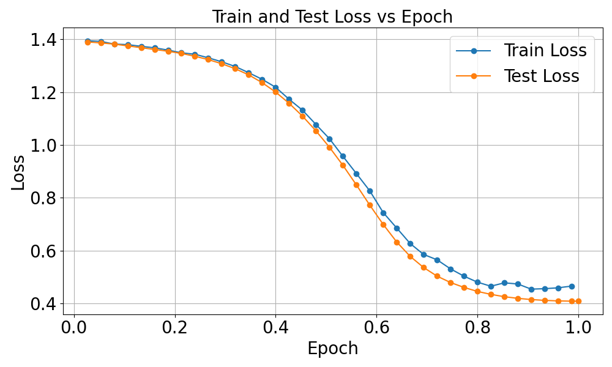

# Deep Learning Spring 2025: LoRA Fine-Tuning for Robust Text Classification on AGNEWS 

## Team Members
- **Member 1:** Nikita Gupta
- **Member 2:** Raghu Vamshi Hemadri
- **Member 3:** Saavy Singh

## Overview
This project addresses the AG News text classification challenge under a strict budget of one million trainable parameters. We begin with the pretrained RoBERTa‑base transformer and apply Low‑Rank Adaptation (LoRA) to introduce trainable, low‑rank modifications to the query and value projection matrices, while freezing the rest of the model. By training only the LoRA adapters and classification head, we limit the number of trainable parameters to approximately 667,396 out of 124,648,708 total.

**Key results:**
- **Test Accuracy:** 88.539% on the held‑out AG News test split  
- **Kaggle Leaderboard Accuracy:** 85.975%
- **Competition Rank:** 5th place on the Kaggle leaderboard

These results show that low‑rank fine‑tuning lets us achieve strong performance with a small parameter footprint, demonstrating an effective trade‑off between model size and accuracy.

## Optimal Parameters
These configurations were used directly from the training script.

- **Base Model:** `roberta-base`  
- **Max Sequence Length:** 128  
- **Train Batch Size:** 32  
- **Evaluation Batch Size:** 64  
- **Learning Rate:** 5e-6  
- **Number of Epochs:** 1  
- **Weight Decay:** 0.01  
- **Freeze Base Model:** True  
- **Train Last K Layers:** 2  

### LoRA Settings
- **LoRA Rank (r):** 2  
- **LoRA Alpha:** 4  
- **LoRA Dropout Rate:** 0.05  
- **LoRA Bias:** none  
- **Target Modules:** query, value  


## Instructions to Run the Code
1. **Clone the Repository**  
   ```bash
   git clone https://github.com/your_username/your_project.git
   cd your_project

2. **Train the model**
   ```bash
   python3 train.py
   ```

The trained model checkpoint will be saved as a .pt file in the best_model/ directory.

3. **Evaluate the model**
   ```bash
   python3 predict.py
   ```

This will load the .pt file from best_model/, run predictions on new data stored there, and generate predictions.csv.
## Results
- **Total Parameters:** 124,648,708  
- **Trainable Parameters:** 667,396  
- **Final Test Accuracy:** 88.539%  
- **Kaggle Leaderboard Accuracy:** 85.975%  
- **Competition Rank:** 5th place on the Kaggle leaderboard


## Plots

### Train–Test Loss Plot


### Accuracy Plot


